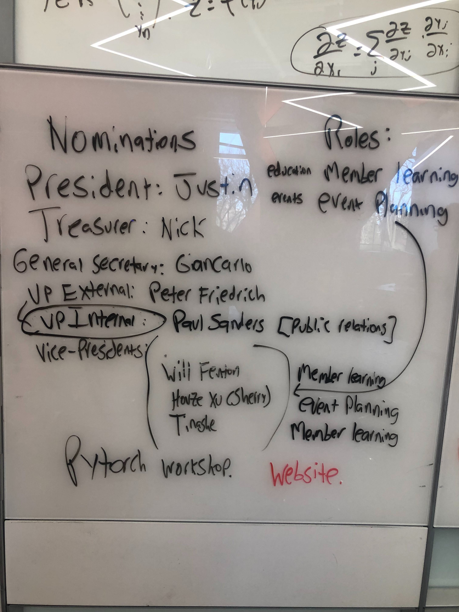
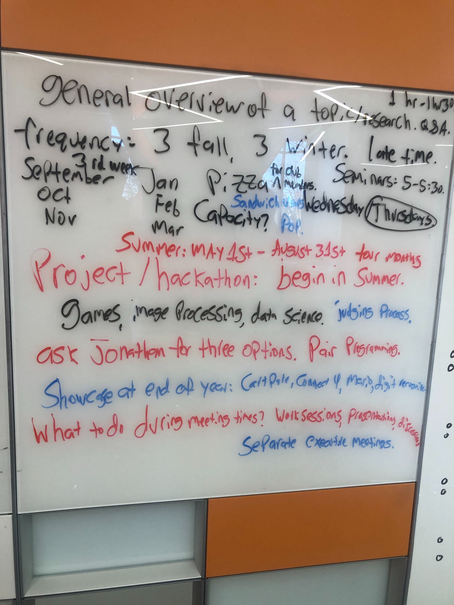

# General Meeting #1 March 15, 2019, All Executive Present (Except Peter although we have a sealed envelope vote)

We mainy held the club elections and talked about future planning.
## **Elections!**
All positions ran unopposed. VP had 4 nominees and one candidate dropped out.
The others got the postion. The elections results were unanimously accepted.
### Here are the results:
#### President:
- Justin Stevens (only nominee)
#### Vice-Presidents:
- Will Fenton
- Houze Xu
- Tinashe Oswell Musariri
#### Treasurer:
- Nick Nissen (only nominee)
#### General Secretary:
- Giancarlo Pernudi Segura (only nominee)
#### VP External:
- Peter Friedrich
#### VP Internal:
- Paul Saunders

## Future Planning Discussion
We talked about:
### Hosting Workshops
- There was a proposal of maybe having two different difficulty levels. One for novices and another aimed at more experienced people.
- Justin had the idea of maybe having a workshop for tensorflow or pytorcb.
- Giancarlo (weird I'm refering myself in the third person) proposed filming the workshops and posting them online for anyone to use.
### Hosting Talks/Lectures
- Thanks to Dr.Schaefer's offer. We can talk to him and get talks from important people in the field.
- Nick commented about needing every talk to be well planned in advance.
- Will mentioned having talks be 90 minutes in length.
- We proposed aiming for Thursday's at around 5:00pm.
- Nick said we could also maybe try and get food.
### Hosting Hackathons
- Tinashe requested we make an effort to host hackathons.
- An idea proposed by Jerry is to host an initial hackathon for prototyping and then converting that into a year-long project.
- Jerry proposed maybe having Judges.
- Maybe having prizes if we get sponsors.
- Nick said we could also maybe try and get food.
### Summer Projects
- We talked about having a summer long project.
- A proposal was made to maybe use games as the problem.
- The goal would be to have a problem that can be solved with different solutions so people can experiment and learn.
- We can always ask Dr.Schaefer for problem suggestions.
### Club Website
- Desire was expressed about having a website for the club.

## BONUS!
Here are some pictures from the meeting:

