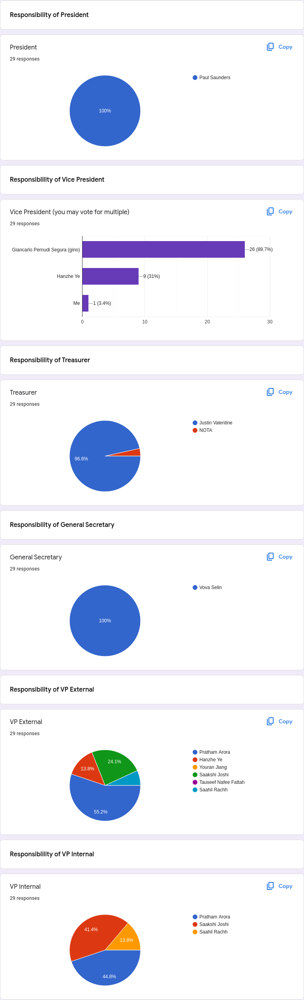

# Meeting Minutes: UAIS General Meeting Election Results

- President, Treasurer & General Secretary are uncontested. Gino Pernudi Segura will continue being president, Nicholas Nissen will continue being Treasurer.
- VP External is contested between Pratham Arora, Hanzhe Ye, Youran Jiang, Saakshi Joshi, Tauseef Nafee Fattah, and Saahil Rachh.
- VP External is contested between Pratham Arora, Saakshi Joshi, and Saahil Rachh.
- Results of elections are as follows:
	- President:
		- Paul Saunders (100%)
	- Vice President:
		- Giancarlo Pernudi Segura (89.7%)
		- Hanzhe Ye (31.0%)
	- Treasurer:
		- Justin Valentine (96.6%)
	- General Secretary:
		- Vova (100%)
	- VP External:
		- Pratham Arora (55.2%)
		- Saakshi Joshi (24.1%)
		- Hanzhe Ye (13.8%)
		- Saahil Rachh (6.9%)
		- Tauseef Nafee Fattah (0.0%)
		- Youran Jiang (0.0%)
	- VP Internal:
		- Pratham Arora (44.8%)
		- Saakshi Joshi (41.4%)
		- Saahil Rachh (13.8%)
- As Pratham won both VP Internal and VP External but cannot both positions, they have chosen to accept the VP Internal position. As such, VP External goes to second place which is Saakshi Joshi.

